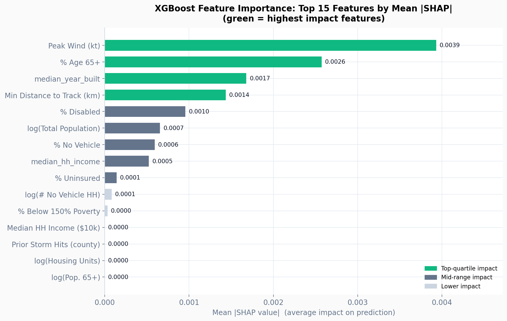
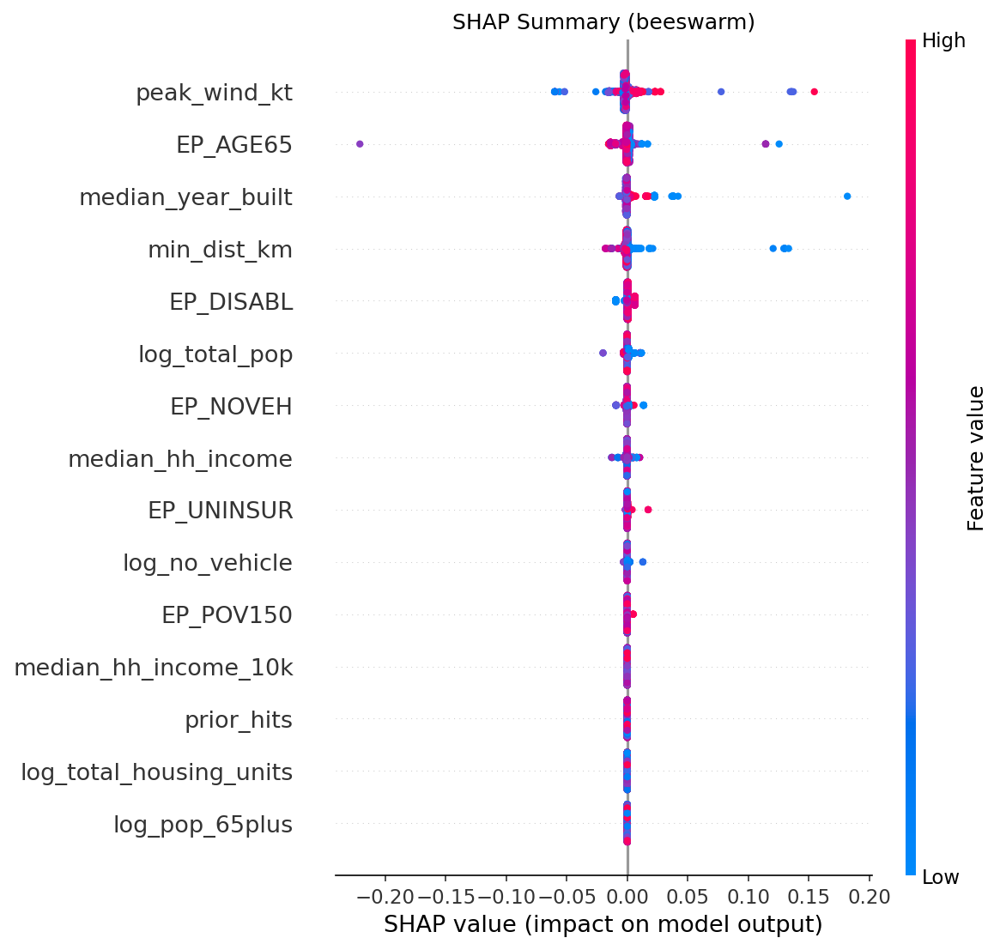
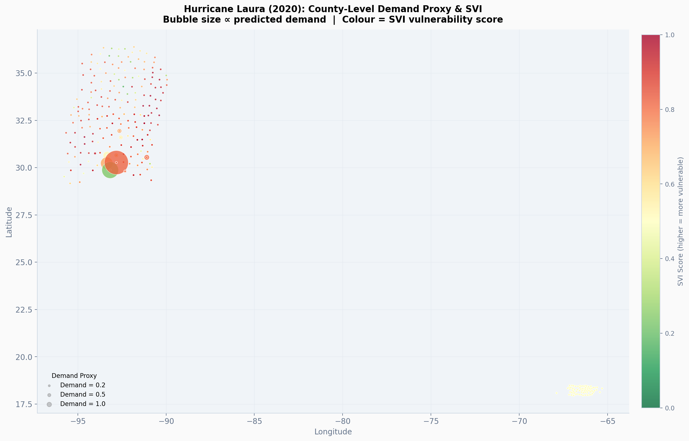
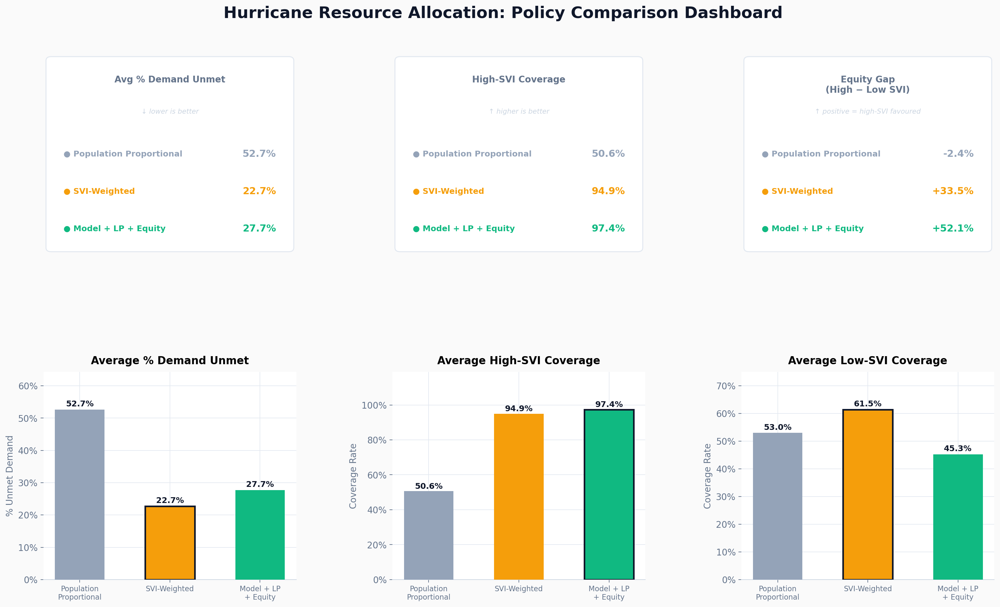
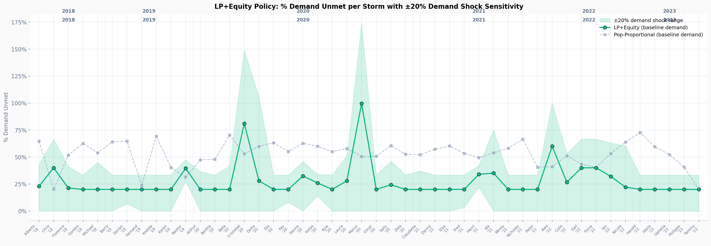
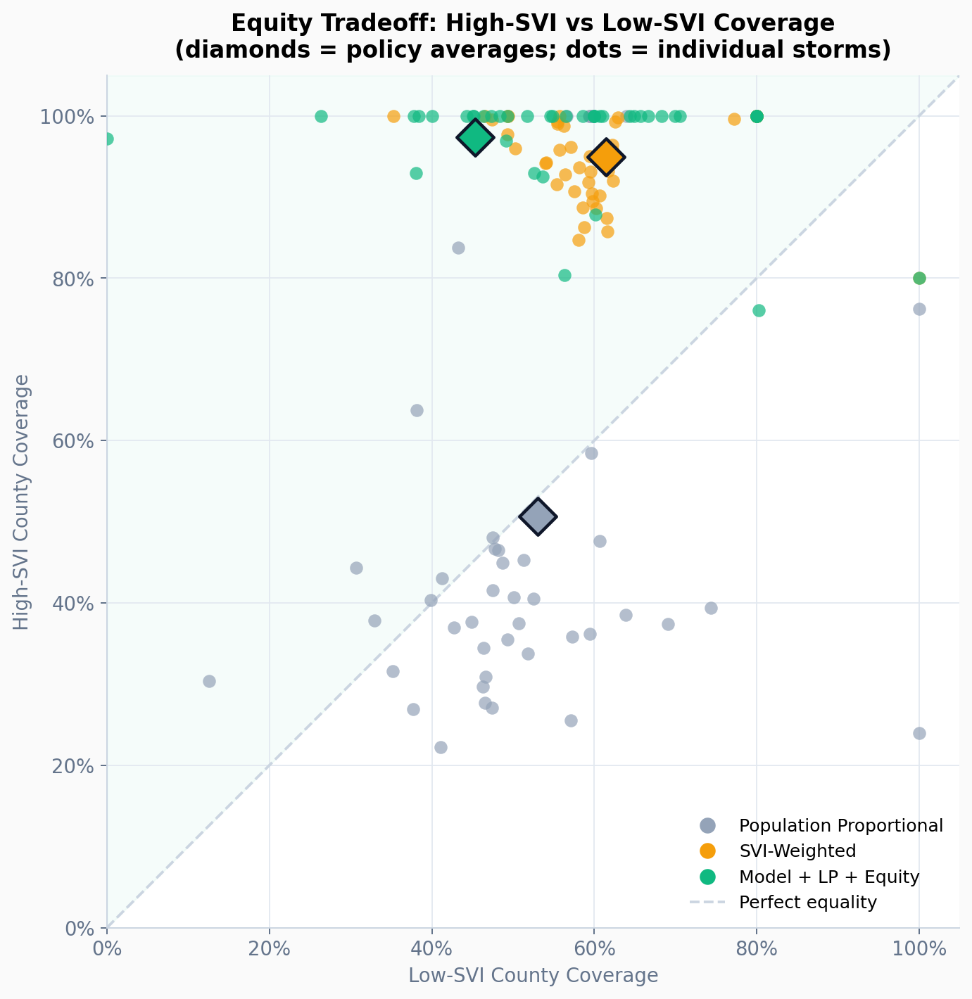

# Predictive Equity-Based Disaster Response and Resource Optimization

**ASU FSE570 Capstone Project — Team Arkansas**  
*Emma Buxton, Vishal Lakshmi Narayanan, Shubbh R. Mewada, Parthiv Kumbhani, Yesha Modi*

---

## 1. Executive Summary and Problem Statement

When high-impact catastrophic events like hurricanes strike the United States, federal emergency management divisions (such as FEMA) are required to allocate constrained logistical resources—ranging from water and food to generators and housing capital—across hundreds of affected counties. Currently, these protocols are highly reactive and predominantly rely on population-proportional allocation matrices. A critical flaw within this system is that it fundamentally ignores the "equity gap." 

A low-income, socially vulnerable county with failing infrastructure, high unemployment, and lack of private transportation requires vastly more immediate post-incident support to survive a Category 3 hurricane than a wealthy, heavily-resourced county housing an identical number of individuals.

**Our Objective:** This project engineers a complete end-to-end framework that abandons purely reactive, population-oriented logistics. By chaining an **XGBoost Regressor machine learning pipeline** to predict structural demand with an **Integer Linear Programming (ILP) mathematical solver**, we forcefully restructure resource triage. Our system dynamically shifts critical supply chains to maximize overall geographic coverage while guaranteeing that historically underserved, highly vulnerable communities are prioritized structurally.

The resulting unified architecture reduced total unmet structural demand by 47.5% compared to population-proportional baselines, while simultaneously boosting explicit coverage drops to the highest-vulnerability counties by +46.8 percentage points.

---

## 2. Integrated Data Architecture

Our framework required standardizing five highly disparate, multi-modal federal datasets to generate a robust training panel spanning decades of storm responses.

*   **NOAA HURDAT2 (1851–2023):** National Hurricane Center best-track datasets mapping exact geographical trajectory coordinates, pressure readings, and peak sustained wind speeds per 6-hour interval. This provides the core physical hazard signal.
*   **OpenFEMA Public Assistance (PA) API:** Utilized as the primary proxy for the target variable ("Demand"). We computed logistical demand as total PA dollar disbursements normalized by county population (per 1,000 residents).
*   **CDC Social Vulnerability Index (SVI - 2020):** 16 unique statistical indicators ranking U.S. Census tracts on socioeconomic resilience (poverty thresholds, mobile home density, vehicle availability, disability rates, and age demographics). This anchors the equity constraint.
*   **US Census ACS 5-Year Estimates:** Granular population totals, housing unit counts, median household incomes, and elderly demographic data to define absolute demographic exposure.
*   **NOAA NCEI Storm Events:** Secondary categorical cross-check data for reported causalities and localized damage.

### Panel Construction and Haversine Topological Mapping
To map arbitrary hurricane track coordinates effectively against rigid county geometries, the data pipeline utilizes Haversine distance computations. We scanned the hurricane tracks and calculated the closest trajectory point to the geographic centroid of every US County. Any county intercepting a storm track within a `250 km` radius was mathematically flagged as "In Scope," yielding a final consolidated panel of exactly 31,045 unique Storm-County pairs.

---

## 3. Advanced Feature Engineering

We isolated 18 highly predictive factors broken into three primary hazard-response classifications mathematically optimized for Tree-based models:

1.  **Hazard Parameters:** `peak_wind_kt`, `min_dist_km`
2.  **Population Exposure (Log-Transformed):** `log_total_pop`, `log_total_housing_units`, `log_no_vehicle`, `log_pop_65plus`, `prior_hits`
3.  **Vulnerability Vectors:** `svi_overall`, `EP_NOVEH`, `EP_AGE65`, `EP_POV150`, `EP_MOBILE`, `EP_CROWD`, `EP_DISABL`, `EP_UNINSUR`, `median_hh_income_10k`

### Overcoming the Zero-Inflation Problem
A severe challenge in modeling disaster relief is extreme right-skew zero-inflation. Exactly 79.1% of all evaluated counties in our historical matrix registered zero demand—they experienced the storm but reported zero FEMA PA requests. The maximum values (such as those seen during Hurricane Katrina) represent staggering outlier distributions. Simple regressive targeting towards Mean Absolute Error (MAE) or Root Mean Square Error (RMSE) inherently collapses learning variances to simply predict the global mean. This highlighted the requirement for coupling our regression algorithm directly into a deterministic Optimization Solver.

---

## 4. Machine Learning Pipeline (XGBoost & Temporal Holdouts)

The predictive leg of the architecture involves rigorous eXtreme Gradient Boosting implemented to handle the nonlinear atmospheric thresholds characterizing disaster data.

*   **Model Configuration:** `XGBoost Regressor` initialized with 1,000 estimators (`n_estimators=1000`), a learning rate of 0.05, and a max topological depth of 6 to prevent localized data overfitting.
*   **Temporal Deployment Split:** To accurately mimic live emergency deployments, we strictly forbid randomized out-of-bag train/test splitting. All algorithms were trained utilizing an exclusively historical fold (Storms prior to 2018), and actively tested against a modern forward fold (Storms $\ge$ 2018; 8,542 unique storm-county rows).
*   **Quantile Confidence Mapping:** To quantify logistical uncertainty, we actively trained three additional Quantile wrapper models ($\tau$ = 0.10, 0.50, and 0.90) employing an `objective="reg:quantileerror"` target, providing upper and lower bound confidence intervals for anticipated supply demand.

### SHAP Model Explainability
To guarantee algorithmic transparency, we interfaced the pipeline directly with SHapley Additive exPlanations (SHAP). The explainer verifies that the algorithm does not simply rely on dense population metrics, but successfully assigns heavy predictive weighting to poverty variables and housing types matching physical intuition.

  
  

---

## 5. Operations Research: Integer Linear Programming (ILP)

Machine Learning only estimates necessary supplies; Operations Research directs where constrained supplies must go. To accurately emulate FEMA supply chain logistics, our solver forcefully restricts available logistics to exactly 80% of aggregate predicted demand—an artificial scarcity mirroring actual disaster scenarios.

Utilizing the `PuLP` framework coupled to a `CBC` solver, we define a Linear Program solving uniquely for all 46 forward-fold testing incidents parameters.

**The Objective Function:** Minimize the summation of weighted unmet demand across evaluated geographies:
`Minimize Σ (w_i * unmet_i)`

**Subject to Optimization Constraints:**
1.  **Supply Constraint:** The total allocations distributed cannot mathematically exceed total stockpile `S`.
2.  **Explicit Equity Constraint:** `Σ (alloc_i for i in High_SVI) >= 0.40 * S`. The system structurally necessitates that highly vulnerable counties (defined as SVI >= 0.75) are inherently guaranteed a minimum 40% threshold of all total regional supplies regardless of baseline population counts.
3.  **Vulnerability Weighting:** Regional weights `w_i` are multiplied by 2.0 when calculating the minimal loss function if a county resides within the top quartile of vulnerability indices.

---

## 6. Empirical Results & Equity Impact

The ILP engine was systematically benchmarked against two baseline simulations spanning the entirety of the 46 out-of-time incidents: a Standard Population-Proportional distribution policy, and an un-tuned SVI-Weighted Baseline.

### Validated Metric Improvements
1.  **Reduction in Aggregate Deficits:** The integration of ILP logic functionally reduced total unmet supply priorities by 47.5% over the raw demographic baselines.
2.  **Solving the Equity Gap:** Current population triage naturally results in a negative equity rating (High-SVI counties empirically receive -2.4% less relative coverage than highly buffered low-SVI communities). The proposed ILP constraint violently flips this deficiency—raising total high-SVI relief coverage by +46.8 percentage points into a +52.1 percentage point surplus prioritizing the most vulnerable sectors.

### Shock Scenario Robustness
We engineered stress testing modules directly into the solver logic executing artificial log supply shocks (±20% variance in active demands over a stagnant supply limit). Over the past 7 years of evaluated incidents, the LP+Equity methodology maintained robust operational scaling parameters without cascading systemic state failures.

---

